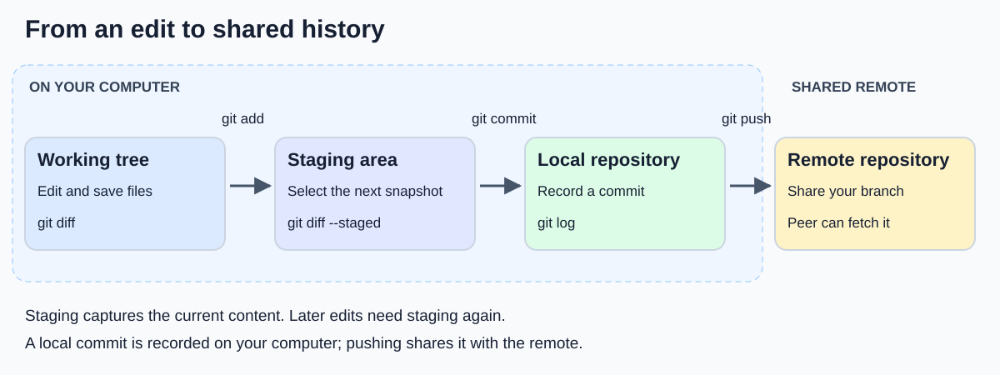
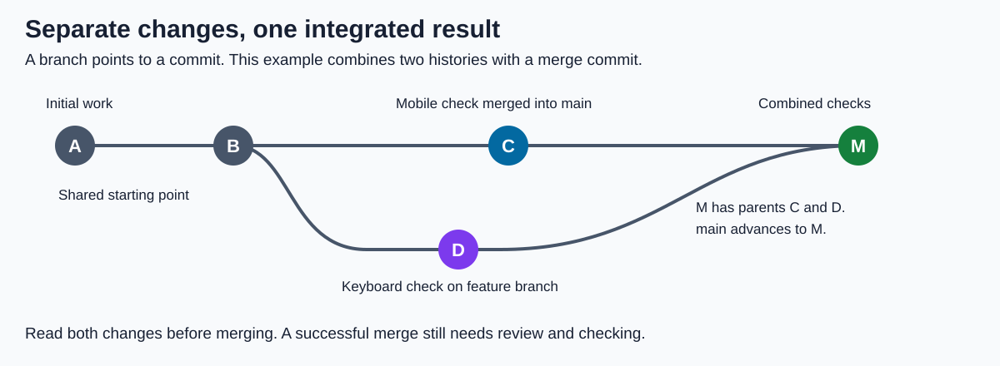
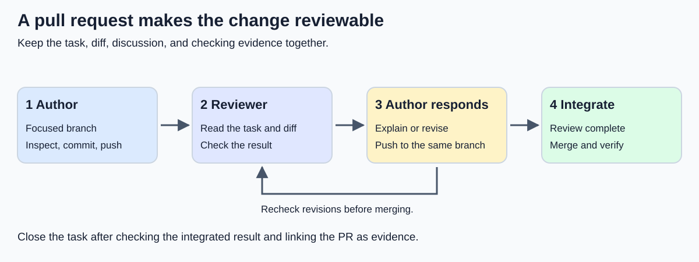

# Session 02 — Git and Collaboration

[Session index](../README.md) · [Student workshop](workshop.md) · [Project Management Guide](../../project_management.md)

**Week 1 · Lecture: 60 mins · Workshop: 60 mins · Supervised Project Lab: 60 mins**

---

## 1. Learning Goals

By the end of this 3-hour block, students will be able to:

1. **Distinguish** the working tree, staging area, local repository, and remote repository.
2. **Explain** how commits, branches, and remotes support shared development.
3. **Complete** a small change through a branch, commit, push, pull request, and peer review.
4. **Resolve** a deliberate merge conflict while preserving both contributors' intended requirements.
5. **Record** contribution evidence and apply safe practices for configuration, credentials, and shared history.

## 2. Session Timetable

| Time | Phase | Focus | Key Activities & Cues |
| :--- | :--- | :--- | :--- |
| **00–10m** | Lecture | **Why version control?** | Retrieve the team objective; discuss two people editing the same file. |
| **10–25m** | Lecture | **The Git model** | Snapshots, staging, branches, and local/remote state; predict which version will be committed. |
| **25–40m** | Lecture | **Branch to reviewed change** | Demonstrate a README change, inspect its diff, open a PR, and model a useful review. |
| **40–50m** | Lecture | **Conflict resolution** | Use prepared branches; read the conflict, agree the result, and complete the merge. |
| **50–60m** | Lecture | **Safe teamwork & concept check** | Recovery, secrets, contribution evidence, and workshop roles. |
| **60–120m** | Workshop | **Author, reviewer, resolver** | Each member authors and reviews a change; practise a deliberate conflict. |
| **120–180m** | Lab | **Apply the workflow** | Finish individual conflict practice; establish the real repository and evidence links. |

The examples below support the live lesson and later reference. Rehearse the demonstrations so explanation and discussion fit the lecture hour.

---

## 3. Core Concepts

### 3.1 Why a Shared Folder Is Not Enough

Imagine three students working on the campus activities portal. One improves the event description, another adds keyboard-testing instructions, and the third fixes setup steps. They exchange `README-final.md`, `README-final-new.md`, and `README-actually-final.md`.

The challenge is deciding **which changes belong together and why**. A shared folder alone does not provide a deliberate review and integration process.

Git records project snapshots connected through history. A commit includes a message, author information, and references to its parent history. Most everyday operations work locally. See [Git's introduction to snapshots](https://git-scm.com/book/en/v2/Getting-Started-What-is-Git%3F).

**Git and GitHub are different:** Git manages version history; GitHub hosts repositories and adds collaboration tools such as pull requests. You can use an editor interface or terminal, but must explain the underlying operations.

**Opening discussion:** Two people change a programme's points value in the VOV scheduler. What should a reviewer establish before accepting either change? Draw out the importance of the requirement, the reason, and a checked result.

### 3.2 The Four Places Your Work Can Be



*Figure 1. Saving, staging, committing, and sharing are separate steps.*

| Place | What it contains | Useful question |
| --- | --- | --- |
| **Working tree** | Files currently available to edit and run | What have I changed? |
| **Staging area / index** | Content prepared for the next commit | What am I about to record? |
| **Local repository** | Recorded commits on this computer | What have I committed? |
| **Remote repository** | Shared history at a configured address | What have we shared? |

`git add` stages file content **as it exists when the command runs**. Editing the file again does not update that staged version. Stage again if the later edit belongs in the commit. See the [git-add reference](https://git-scm.com/docs/git-add).

Use these inspection commands throughout the demonstration:

```sh
git status
git diff
git diff --staged
git log --oneline -5
```

- `git status` summarises the branch and file states, including untracked files.
- `git diff` shows unstaged changes to tracked files.
- `git diff --staged` shows what the next ordinary commit will change relative to the current commit.
- `git log --oneline -5` shows the five most recent commits reachable from the current position.

Untracked file contents do not appear in ordinary `git diff`; inspect them and check the staged diff after adding them. See the [git-diff reference](https://git-scm.com/docs/git-diff).

**Predict before running:** Edit README sentence A, stage it, then change it to sentence B without staging again. Which sentence does `git commit` record? **A.** The working tree still contains B. Ask students why one file can have both staged and unstaged changes.

### 3.3 Commits Should Express an Intention

A useful commit is a change a teammate can understand and review. Today that might be two README instructions. Later, it could be a validation fix and the test that demonstrates it.

| Weak message | Clearer message |
| --- | --- |
| `stuff` | `Document how to open the activity list` |
| `fix bug` | `Exclude cancelled sessions from workload totals` |
| `update everything` | `Show an empty state when no projects match` |

Keep unrelated changes separate. Combining a feature, a large formatting change, and deleted files makes it harder to identify what changed the behaviour. Commit at meaningful points and explain the purpose. Commit count does not establish correctness or value.

### 3.4 Branches Let Work Develop Before Integration



*Figure 2. This example uses a merge commit with two parents. Lines show development progressing left to right; a conflict is possible, not inevitable.*

A branch is a movable reference to a commit. `HEAD` normally identifies the checked-out branch. Making a commit advances that branch; switching branches changes the checked-out version of the files. A new branch initially points to its starting commit. See [Branches in a Nutshell](https://git-scm.com/book/en/v2/Git-Branching-Branches-in-a-Nutshell).

Use a shared `main` branch and short-lived branches for focused changes, such as `docs/anna-testing` or `fix/cancelled-session-total`. A branch name does not reserve files exclusively for its author.

Before two people change the same API response or database structure, agree on the expected result. Integrate small reviewed changes regularly so differences do not accumulate for weeks.

### 3.5 Local and Remote Are Separate

`origin` is the conventional remote name created when cloning. `main` is your local branch; `origin/main` is your local record of the remote branch's last fetched state.

| Operation | Effect | What it does not establish |
| --- | --- | --- |
| **Clone** | Creates a local repository from an existing repository | Permission to push to it |
| **Commit** | Records staged content locally | That a teammate can see it |
| **Push** | Sends commits and requests a remote branch update | That the change is reviewed or merged |
| **Fetch** | Downloads remote history and updates remote-tracking references | That your current files incorporate it |
| **Merge** | Integrates another history into the current branch | That the combined behaviour is correct |
| **Pull** | Fetches and then integrates according to its options | That every divergence can be resolved automatically |

Use `git pull --ff-only` to update a clean local `main`. It advances the branch only when there is no divergent local history to combine. If it refuses, inspect the history with the lecturer rather than guessing a reset. See the [fetch](https://git-scm.com/docs/git-fetch) and [pull](https://git-scm.com/docs/git-pull) references.

---

## 4. Worked Example: A Change Through Peer Review

### 4.1 Define the Change

The campus activities team's card says:

> A new tester can find the activity list and knows what to check on a small screen.

For this documentation exercise, the acceptance criteria are:

- README identifies the `/events` route.
- It explains the expected small-screen check.
- Another member reads the rendered instructions and confirms they are understandable.

The application need not exist in week 1. Label future checks as planned; do not report that an unbuilt feature passed testing.

### 4.2 Start a Branch and Inspect the Change

These commands assume a cloned practice repository with `main` and `origin`, a configured Git identity, and permission to push. Start with `git status`; continue only with a clean working tree. Resolve unfamiliar local changes with the lecturer first.

```sh
git status
git switch main
git pull --ff-only
git switch -c docs/anna-testing
```

Now **edit `README.md` in your editor** and add:

```markdown
## Planned activity-list checks

When the activity page is available, open `/events`.
At a narrow mobile width, check that the list is readable without horizontal page scrolling.
```

Return to the terminal:

```sh
git diff -- README.md
git add README.md
git diff --staged
git commit -m "Document planned mobile checks for the activity list"
git push -u origin docs/anna-testing
```

Pause before committing: **Does the staged diff contain exactly the intended change?** Explicit filenames help. `-u` records the remote tracking relationship, so later pushes on this branch can normally use `git push`.

### 4.3 Open a Pull Request



*Figure 3. Review may send work back to the author before integration.*

On GitHub, open a PR with **base `main`** and **compare `docs/anna-testing`**. The base is the destination; the compare branch supplies the change. A PR displays the diff and supports discussion before merging. See [GitHub's pull request reference](https://docs.github.com/en/pull-requests/reference/pull-requests).

Use the shared [PR description template](../../project_management.md#pull-request-description):

```text
Related card: Document planned activity-list checks
What user-facing outcome changed:
The README identifies the route and the planned mobile reading check.
How I checked it:
Read the staged diff and previewed the rendered Markdown.
Known limitations / help needed:
The application is not built yet; these are planned checks, not test results.
```

### 4.4 Review the Behaviour and Explanation

The reviewer reads the task, inspects every changed file, and performs the relevant check. For this PR, preview the Markdown. For a later functional change, run the affected journey and relevant tests.

| Review lens | Useful question |
| --- | --- |
| Purpose | Does this satisfy the acceptance criteria? |
| Correctness | What happens for normal, empty, invalid, or missing input? |
| Clarity | Could the next member understand and maintain it? |
| Scope | Are unrelated changes or generated files included? |
| Evidence | What was actually checked? What remains uncertain? |

Model specific, respectful comments:

- **Question:** “Does this instruction apply before the application is deployed?”
- **Requested change:** “Please label this as a planned check so readers do not mistake it for a passing test.”
- **Verified result:** “I previewed the Markdown; the route and expected mobile behaviour are clear.”

Explain the reason for a requested change and distinguish a correctness issue from a preference. The author responds, edits, commits, and pushes to the same branch; the PR updates.

### 4.5 Merge and Close the Loop

After review, merge using the repository's agreed method. Figure 2 illustrates a merge commit; hosting tools may also offer squash or rebase methods. Use one agreed approach for the exercise.

Then update a clean local checkout:

```sh
git switch main
git pull --ff-only
git log --oneline -5
```

Inspect the integrated README and link the PR from the task card. Merging combines history; checking establishes whether the intended result survived.

---

## 5. Worked Conflict: Preserve Both Requirements

### 5.1 Prepare Two Changes From One Starting Point

Use a disposable practice repository. The lecturer prepares a committed `README.md` containing this exact line:

```text
Testing: check the activity list.
```

Two branches begin from that same commit. The `docs/mobile-check` author replaces it with:

```text
Testing: check the activity list on a narrow mobile screen.
```

The `docs/keyboard-check` author replaces the same line with:

```text
Testing: check the activity list using only the keyboard.
```

Both authors commit and push. Review and merge the mobile branch first. Keep the keyboard branch at its original change until the demonstration.

### 5.2 Bring Main Into the Second Branch

On the clean `docs/keyboard-check` branch:

```sh
git status
git fetch origin
git merge origin/main
```

The **current branch receives** changes from `origin/main`. Git often combines independent edits automatically; these competing edits to the same line require a decision. In the default conflict style:

```text
<<<<<<< HEAD
Testing: check the activity list using only the keyboard.
=======
Testing: check the activity list on a narrow mobile screen.
>>>>>>> origin/main
```

For **this merge**, `HEAD` is the keyboard branch and `origin/main` is the incoming version. Editor labels such as “current” and “incoming” depend on the operation. Read the content before accepting a side. Other conflict styles may also show the common ancestor.

### 5.3 Agree the Result and Complete the Merge

Both authors intended a useful requirement. Replace the entire marked block with:

```text
Testing: check the activity list on a narrow mobile screen and using only the keyboard.
```

Save and inspect before continuing:

```sh
git diff -- README.md
git add README.md
git diff --staged
git diff --staged --check
git status
git commit -m "Merge main and retain mobile and keyboard checks"
git push
```

Staging marks the conflict as resolved; it does not prove correctness. `--check` helps catch introduced conflict markers and whitespace problems. Read the final file and review the updated PR before merging.

If the intended resolution is unclear, ask the other author. From an in-progress merge begun with a clean working tree, `git merge --abort` can return to the pre-merge state. See [Git's merge documentation](https://git-scm.com/docs/git-merge).

### 5.4 A Clean Merge Can Still Be Wrong

One person renames an API field from `title` to `name`; another adds a component reading `title` in a different file. Git might merge both edits successfully, but the page can display a blank heading.

**Which check reveals this?** Review the shared API contract and test the integrated page. Conflict markers identify textual ambiguity, not every disagreement in programme behaviour.

---

## 6. Safe and Sustainable Team Practice

### 6.1 Inspect Before Trying to Repair

| Situation | First response |
| --- | --- |
| Wrong file staged | Inspect it, then use `git restore --staged README.md` for that file. Working-tree edits remain. |
| `git pull --ff-only` refuses | Inspect `git status` and `git log --oneline --graph --all -10`; establish why the histories differ. |
| Push rejected | Read the message; check access or fetch and inspect history according to the cause. |
| Merge conflict | Read both versions and agree the intended result. |
| Unexpected files in a PR | Inspect the diff and coordinate a correction before merging. |

`git restore --staged` differs from `git restore` without that option: the latter can replace working-tree content and discard uncommitted edits. See the [restore reference](https://git-scm.com/docs/git-restore). Do not use force pushes, hard resets, or file deletion as guesses to clear an unfamiliar error.

### 6.2 Keep Local Configuration Out of Commits

A starting `.gitignore` for this course might include:

```gitignore
node_modules/
dist/
coverage/
.env
.env.*
!.env.example
```

Commit `.env.example` with safe placeholders and configuration explanations. Normally commit the application's dependency lockfile so teammates can reproduce dependency resolution.

Ignore rules apply to untracked files; adding a tracked secret to `.gitignore` does not remove it from history. See the [gitignore reference](https://git-scm.com/docs/gitignore). If credentials are exposed, notify the lecturer and revoke or rotate them through the service owner. Deleting the visible line alone is insufficient.

### 6.3 Make Contribution Understandable

Keep links to authored PRs, substantive reviews, tests, design decisions, and documentation. Every member must contribute technical work and explain it. Commit counts alone do not measure contribution; record both participants and their roles when pairing.

Follow the [course AI policy](../../../syllabus/syllabus.md): acknowledge AI use, retain relevant examples, and understand submitted work. AI-generated changes need the same review and checking as other work.

Agree who reviews each card, when the team responds, and when blockers are raised. Use the [team workbook's Definition of Done](../../project_management.md#definition-of-done). Today's README exercise needs a documentation check; it does not introduce a requirement to build CI or an application test suite during week 1.

---

## 7. Formative Checks and Class Discussion

Use these throughout the lecture and revisit unresolved answers in the final ten minutes.

| Prompt | Expected explanation |
| --- | --- |
| “I saved the file. Can my teammate see it?” | Saving changes the working tree. This workflow shares work through commit and push. |
| “I staged a file, then edited again. What gets committed?” | The staged version; stage again to include the later edit. |
| “I pushed my feature. Is it on main?” | Pushing a feature branch shares it. Integration is separate. |
| “I fetched. Why did my open file not change?” | Fetch updates remote history references without merging into the current branch. |
| “Git merged successfully. Are we finished?” | Inspect and check the integrated behaviour. |
| “Can I accept my side of every conflict?” | Only if it is the agreed correct result; preserve the underlying requirements. |

**Transfer to the real briefs:** For the media showcase, propose a review question about who can see unpublished entries. For VOV, propose one about whether cancelled work contributes points. Connect the diff to the client's intended behaviour.

## 8. Workshop and Lab Instructions

Follow the detailed [student workshop](workshop.md); this summary preserves its timing and evidence requirements.

### Workshop — 60 Minutes

1. **0–10m:** Follow the demonstration and identify when work becomes shared.
2. **10–30m:** Each person authors a README PR and reviews another member's PR. Merge sequentially.
3. **30–45m:** Two members create and resolve the deliberate conflict; the third observes and explains.
4. **45–60m:** Show the reviewed change, explain the resolution, and write a team workflow rule.

### Supervised Project Lab — 60 Minutes

Use **5 minutes to plan, 45 to work, and 10 to record progress**. Rotate roles so every member resolves a staged conflict. Establish the real repository, README, access, ignore rules, and contribution/AI evidence locations. Link the board and team agreement.

Before leaving, retain:

- One authored and one reviewed PR per member.
- Evidence that every member practised and explained a conflict resolution.
- Links to the accessible real repository, board, and team workflow.

This is an **ungraded setup check**. Before session 3, read the assigned brief and bring questions about users, requirements, and scope.

## 9. Preparation Checklist and Reading

### Lecturer Checklist

- [ ] Rehearse in a disposable repository; verify clone/push access through normal authenticated tools.
- [ ] Configure the demonstration identity locally and check that `main` and `origin` exist.
- [ ] Prepare the exact starting line and two conflicting branches from section 5.
- [ ] Rehearse PR review, merge, and local-main update.
- [ ] Preview the local diagrams and enlarge terminal text for projection.
- [ ] Keep deliberate conflicts separate from the real client repositories.

### Student Reading

- [Team workflow, PR template, and contribution records](../../project_management.md).
- [WSK development tools and repository setup](../../../reference_materials/WSK-main/Week1/tools_pt2.md).
- [Git: snapshots and local states](https://git-scm.com/book/en/v2/Getting-Started-What-is-Git%3F).
- [Git: branches](https://git-scm.com/book/en/v2/Git-Branching-Branches-in-a-Nutshell).
- [GitHub: pull requests](https://docs.github.com/en/pull-requests/reference/pull-requests).

The diagrams are original course illustrations stored in [images](images/), with text alternatives and explanations alongside them.
