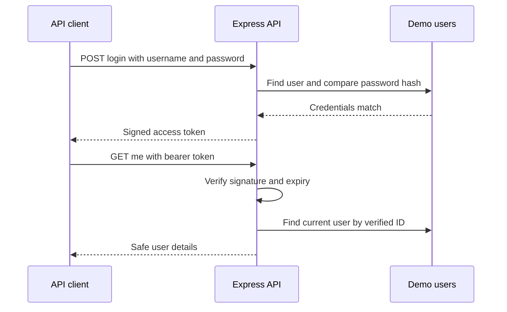

# Logins and access tokens

**Session 3 optional supplement**

How does an API know who is asking?

[Workshop](workshop.md) · [Supplement guide](README.md)

<!--
Lecturer notes: 0–1 min. Audience: students with JavaScript basics.
This is a separate 30-minute supplement, not a replacement for the requirements lesson.
Use the campus activities API throughout. The goal is to explain and build
credentials → token → protected request. Keep the solution running for the demo.
-->

---

## 1. Some information needs an access rule

- Anyone can browse a published campus activity.
- A signed-in student can see their own account.
- An organiser can see the unpublished activity count.

**Who should decide whether a request is allowed?**

<!--
Lecturer notes: 1–3 min. Answer: the API must enforce the rule on every protected
request. A hidden button does not stop someone sending the request directly.
Connect to the real briefs: staff-only showcase drafts, VOV manager/viewer
permissions, booking applicants' private requests.
[Sources]
- ../../../Projects/Media_Student_Showcase/media_student_showcase_project.md
- ../../../Projects/VOV_staff_scheduler/vov_staff_scheduler_project.md
- ../../../Projects/Lab_Equipment_Booking/lab_equipment_booking_project.md
The campus scenario is fictional and adds no project requirements.
-->

---

## 2. A request has more than a URL

```http
POST /api/auth/login
Content-Type: application/json

{"username":"alice","password":"StudentPass!23"}
```

- **Method + path:** what action are we asking for?
- **Headers:** information about the request.
- **Body:** the JSON data we send.

The server returns a status code and, here, a JSON body.

<!--
Lecturer notes: 3–5 min. These are public, fictional workshop credentials.
Show the corresponding Postman fields. HTTP does not automatically attach
the identity from an earlier login to a new request. Our client sends a token.
A browser address bar sends a GET; it cannot perform this JSON login POST.
[Sources]
- https://developer.mozilla.org/en-US/docs/Web/HTTP/Guides/Messages
-->

---

## 3. Express connects a request to JavaScript

```js
app.use(express.json());

app.get('/api/activities', (req, res) => {
  res.json([{ id: 1, title: 'Campus coding club',
    published: true }]);
});
```

`req` contains the request. `res` sends the response.

A **route** connects an HTTP method and path to a function.

<!--
Lecturer notes: 5–7 min. Isolated excerpt from src/app.js, not a complete server.
Explain the callback, JSON parsing, req.body, and res.status(401).json(...).
For asynchronous password comparison we use an async function and await.
The supplied server/configuration scaffolding is already complete.
[Sources]
- https://expressjs.com/en/guide/routing.html
- https://expressjs.com/en/api.html#express.json
-->

---

## 4. Identity and permission are separate questions

| Question | Name | Example |
| --- | --- | --- |
| Who are you? | Authentication | Are these Alice's credentials? |
| May you do this? | Authorisation | May Alice read staff information? |

A successful login does not give access to every route.

<!--
Lecturer notes: 7–9 min. Ask: can a student with a valid token read the organiser
summary? No. Later we will observe 403. Role checks are one kind of authorisation;
the booking project also needs ownership checks on each applicant's records.
[Sources]
- https://cheatsheetseries.owasp.org/cheatsheets/Authentication_Cheat_Sheet.html
- https://cheatsheetseries.owasp.org/cheatsheets/Authorization_Cheat_Sheet.html
-->

---

## 5. Store a password hash; compare at login

When creating an account, hash its password:

```js
const passwordHash = await bcrypt.hash(password, 12);
```

When logging in, compare against the stored hash:

```js
const matches = await bcrypt.compare(password, user.passwordHash);
```

The stored value is not plaintext or a password to decrypt.

<!--
Lecturer notes: 9–11 min. The starter already contains fictional users with hashes.
No registration/database setup is required today. Hashing is designed to be
one-way and costly to guess; weak passwords can still be guessed.
bcrypt includes a salt in the hash; don't hash again and compare strings.
The number 12 is the example's work factor. Explain await as waiting for a result.
bcrypt uses at most 72 input bytes; this example rejects longer passwords.
[Sources]
- https://github.com/kelektiv/node.bcrypt.js
-->

---

## 6. Login gives the client a token to send later



Credentials are checked once at login. The returned token is verified on each protected request.

<!--
Lecturer notes: 11–14 min. Original course diagram. The same Express API signs and
verifies here; there is no separate authentication service to install.
Text alternative: the client sends credentials; the API checks the stored hash
and returns a token. On a later request the client sends that token; the API
verifies it and looks up the user before returning protected data.
Demonstrate login with the solution and point to the token in the response.
[Sources]
- https://github.com/auth0/node-jsonwebtoken
-->

---

## 7. A JWT is signed data, not a secret container

`header.payload.signature`

Example decoded payload:

```json
{"sub":"1","iat":1700000000,"exp":1700000900}
```

- `sub`: user identifier.
- `iat` / `exp`: issued-at / expiry times.
- These signed JWT contents can be read. **Never include passwords.**

<!--
Lecturer notes: 14–16 min. The payload above is illustrative and historical,
not a usable token. The example token contains only sub, iat, and exp.
A signature lets the API detect alteration; it does not encrypt the contents.
Decoding is not verification. Do not paste real tokens into online decoders.
JWT is one token format; not every access token is a JWT.
[Sources]
- https://www.rfc-editor.org/rfc/rfc7519
- https://github.com/auth0/node-jsonwebtoken
-->

---

## 8. A bearer token works for whoever holds it

```http
GET /api/auth/me
Authorization: Bearer <token returned by login>
```

- Copy only the token string; do not include JSON quotes.
- Send it in the header, not in the URL.
- Keep it out of Git, screenshots, and shared logs.
- Use HTTPS when sending credentials or tokens over a network.

<!--
Lecturer notes: 16–18 min. Treat a bearer token as a temporary credential.
The local exercise uses HTTP on 127.0.0.1 only; it is not a deployment example.
Use Postman's local/private request state, not a shared collection containing
a live token. Keep browser integration for later: in-memory state loses the
token on reload, while browser storage and cookies have different security
tradeoffs. Do not teach localStorage as the default place for credentials.
[Sources]
- https://www.rfc-editor.org/rfc/rfc6750#section-5
-->

---

## 9. Middleware checks before the handler runs

```js
app.get('/api/auth/me', requireAuth, (req, res) => {
  res.json({ user: req.user });
});
```

`requireAuth` must:

1. Read the bearer header.
2. Verify the signature and expiry.
3. Find the user, then call `next()`.

If a check fails, send `401` and stop.

<!--
Lecturer notes: 18–21 min. Excerpt from app.js; requireAuth comes from the factory
in auth.js. Explain next() as continuing to the next handler in this route.
Show jwt.verify(token, secret, { algorithms: ['HS256'] }) in the solution.
Never use jwt.decode as the access check. Server configuration and the signing
secret stay on the server. Changing token payload text cannot grant a new role.
[Sources]
- https://expressjs.com/en/guide/using-middleware.html
- https://github.com/auth0/node-jsonwebtoken
-->

---

## 10. A failed request tells us which check stopped it

| Status | Meaning in this workshop |
| --- | --- |
| `200` | Request succeeded |
| `400` | Login input is malformed or missing |
| `401` | Credentials or token are missing, invalid, or expired |
| `403` | User is authenticated but lacks organiser permission |

**Predict:** Alice logs in correctly, then requests the staff summary.

<!--
Lecturer notes: 21–23 min. Answer: 403. Demonstrate no-header /me → 401,
valid-token /me → 200, then Alice /staff/summary → 403.
An invalid username and wrong password produce the same generic login error.
[Sources]
- https://developer.mozilla.org/en-US/docs/Web/HTTP/Reference/Status
-->

---

## 11. Expiry and logout solve different problems

Our tokens expire **15 minutes** after issuance.

- An expired token requires a new login.
- Removing a token stops that client sending it.
- A saved copy can still work until expiry.
- Immediate invalidation needs additional server-side state.

<!--
Lecturer notes: 23–25 min. There is no logout endpoint or revocation list today.
Explicitly demonstrate that copying a token, clearing it in the client, and
resending the copy still succeeds before expiry. Do not promise that deleting
a token logs out every session. Refresh tokens and revocation are later topics.
[Sources]
- https://www.rfc-editor.org/rfc/rfc7519#section-4.1.4
- https://www.rfc-editor.org/rfc/rfc7009
-->

---

## 12. The same API pattern connects to your project

| Today | Later |
| --- | --- |
| In-memory fictional users | SQL users queried through mysql2 |
| Postman or curl | React sends requests with fetch |
| Student / organiser roles | Your brief's roles and ownership rules |
| Local demonstration | HTTPS deployment and full account lifecycle |

The backend remains responsible for access decisions.

<!--
Lecturer notes: 25–27 min. Read the SQL bridge after the workshop. The lookup
will become asynchronous; both login and middleware must await it.
Showcase needs staff-only draft access; VOV needs manager/viewer rules;
booking needs ownership as well as roles. Avoid adding requirements to briefs.
Registration, password recovery, rate limiting, session/revocation design,
and browser storage decisions need further work before real deployment.
[Sources]
- ../../README.md
- https://sidorares.github.io/node-mysql2/docs
-->

---

## 13. Build it, then try requests that should fail

Complete three focused tasks:

1. Compare the password.
2. Sign a short-lived token.
3. Verify the token before allowing access.

Before finishing, explain:

- How does the server recognise the user?
- Why does modifying a token make verification fail?
- Why does logging in not grant every permission?

[Begin the workshop](workshop.md)

<!--
Lecturer notes: 27–30 min. Take predictions before showing answers.
The scaffold intentionally rejects login until TODO 1 is done, then returns
501 until TODO 2 is done. Protected requests remain denied until TODO 3 is done.
This is expected learning scaffolding, not an installation failure.
Evidence: status/result table and short explanations, with no live tokens.
-->
