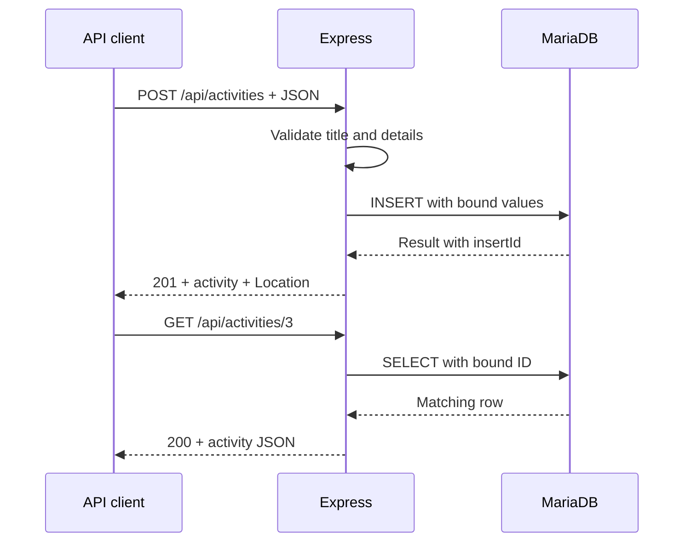

# MariaDB with GET and POST

[Workshop](workshop.md) · [Setup](setup.md) · [Lecturer guide](lecturer-guide.md)

**Session 4 supplement · 30 minutes · Basic SQL assumed**

Today's result: create a campus activity through HTTP, retrieve it, and retrieve it again after restarting the backend.

<!-- Slide 1, 0–2 min. Show the final POST/GET flow before any code. Keep MariaDB running while restarting Node. -->

---

## 2. What changes from session 3?

An array belongs to a running Node process. A table belongs to the database.

| Component | Responsibility |
| --- | --- |
| Postman | Send HTTP requests and inspect responses |
| Express | Match routes, validate input, run handlers |
| mysql2 | Carry SQL and values between Node and MariaDB |
| MariaDB | Store and retrieve records |

This exercise is standalone; no bearer token is needed.

<!-- 2–4 min. Retrieve SELECT/INSERT knowledge. Same campus theme, separate application. Ask which component keeps records after Node stops. -->

---

## 3. Follow one request



Text equivalent: the client sends HTTP to Express; Express validates and sends SQL to MariaDB; MariaDB returns a result; Express sends JSON and an HTTP status.

<!-- 4–6 min. The example ID 3 assumes a fresh database. The browser/client does not connect directly to MariaDB. Point out that HTTP verbs and SQL commands belong to different interfaces. -->

---

## 4. A small familiar table

```sql
CREATE TABLE activities (
  id INT NOT NULL AUTO_INCREMENT PRIMARY KEY,
  title VARCHAR(120) NOT NULL,
  details TEXT NOT NULL
);
```

| id | title | details |
| --- | --- | --- |
| 1 | Board games | Meet in Room A |
| 2 | Drawing club | Bring a sketchbook |

The database assigns IDs. A POST body supplies title and details.

<!-- 6–8 min. This is the conceptual schema; supplied schema.sql adds IF NOT EXISTS, InnoDB and utf8mb4. Recap primary key without repeating the full SQL lesson. IDs need not be consecutive. -->

---

## 5. Configure a connection pool

Supplied in `src/config.js` and `src/db.js`:

```js
import mysql from 'mysql2/promise';

const pool = mysql.createPool({
  host: process.env.DB_HOST,
  port: Number(process.env.DB_PORT),
  user: process.env.DB_USER,
  password: process.env.DB_PASSWORD,
  database: process.env.DB_NAME,
  connectionLimit: 5,
});
```

The pool reuses database connections. Settings belong in local `.env`.

<!-- 8–10 min. This slide is an excerpt; the real config also validates values. The app account has SELECT/INSERT only. Database port 3306 differs from HTTP port 3000. Source: https://sidorares.github.io/node-mysql2/docs -->

---

## 6. Wait for the database

```js
const [rows] = await pool.execute(
  'SELECT id, title, details FROM activities ORDER BY id',
);
```

- `await` waits for the database result in this handler.
- SELECT produces rows; the driver also returns metadata.
- `[rows]` keeps the rows for our response.

The surrounding handler must be `async`.

<!-- 10–12 min. Ask what would happen if we responded before the query completed. Await does not mean every request blocks the entire Node process. Source: https://sidorares.github.io/node-mysql2/docs/examples/queries/prepared-statements/select -->

---

## 7. GET a collection

```js
async list(req, res) {
  const [rows] = await pool.execute(
    'SELECT id, title, details FROM activities ORDER BY id',
  );
  return res.status(200).json(rows);
}
```

`GET /api/activities` → `200` and an array.

No records → `200` and `[]`. The collection request still succeeded.

<!-- 12–14 min. app.js connects this handler to the GET route. Distinguish rows from rows[0]. The workshop first TODO has exactly this responsibility. -->

---

## 8. GET one record

After validation, `res.locals.activityId` holds the numeric route ID.

```js
const [rows] = await pool.execute(
  'SELECT id, title, details FROM activities WHERE id = ?',
  [res.locals.activityId],
);
if (rows.length === 0) {
  return res.status(404).json({ error: 'Activity not found.' });
}
return res.status(200).json(rows[0]);
```

`GET /api/activities/1` requests one object, not an array.

<!-- 14–16 min. Ask students to distinguish an absent valid ID (404) from abc (400). Do not assume IDs always start at 1 once a database has been used. -->

---

## 9. Values are separate from SQL

```js
await pool.execute(
  'SELECT id, title, details FROM activities WHERE id = ?',
  [id],
);
```

`?` marks a value supplied separately. Do not build SQL by joining request text into the statement.

Validation checks whether input fits the application. Parameters keep values separate from SQL instructions.

<!-- 16–18 min. Use a title with an apostrophe as an ordinary example. Parameters are for values, not arbitrary table names. Source: https://sidorares.github.io/node-mysql2/docs/documentation/prepared-statements -->

---

## 10. POST creates a record

```http
POST /api/activities
Content-Type: application/json

{"title":"Campus coding club","details":"Bring a laptop to Room B."}
```

After validation:

```js
const { title, details } = res.locals.activity;
const [result] = await pool.execute(
  'INSERT INTO activities (title, details) VALUES (?, ?)',
  [title, details],
);
const activity = { id: result.insertId, title, details };
return res.location(`/api/activities/${activity.id}`)
  .status(201).json(activity);
```

<!-- 18–21 min. INSERT gives a result header, not SELECT rows. Read insertId from it. Location points to the GET route. Let students predict the result before sending. -->

---

## 11. Validate before querying

The supplied middleware requires:

- JSON containing title and details as strings.
- Nonblank text after trimming.
- Title up to 120 characters; details up to 2,000.
- A valid positive integer for a route ID.

`req.body` starts as client input. `res.locals.activity` contains the checked fields for this request.

<!-- 21–23 min. A client-supplied id is ignored; MariaDB assigns it. Run invalid POST and show no new record. Explain that middleware is already supplied so student time goes to handlers and queries. -->

---

## 12. Responses tell a story

| Situation | Status |
| --- | --- |
| Collection or record read | 200 |
| Record created | 201 |
| Invalid fields, malformed JSON, or invalid ID | 400 |
| Valid ID with no matching record | 404 |
| Body exceeds the supplied size limit | 413 |
| Unexpected database failure | 500 |
| Starter task not completed yet | 501 |

Express 5 forwards rejected async handlers to the supplied error middleware. Clients receive a generic database error, not SQL details or credentials.

<!-- 23–25 min. 501 is a temporary teaching checkpoint, absent in the solution. Source: https://expressjs.com/en/guide/error-handling/ -->

---

## 13. Prove persistence

1. POST an activity; retain the returned ID.
2. GET that ID and inspect the stored row using SQL.
3. Stop **Node** with Ctrl+C; leave MariaDB running.
4. Start Node again and GET the same ID.

The API process handles requests. MariaDB retains the record.

<!-- 25–28 min. Ask whether repeatedly sending POST should create another row: yes, this API has no deduplication. Auto-increment IDs can have gaps. Re-running npm setup does not reset the database. -->

---

## 14. Your workshop

Complete three handlers in `src/activities.js`:

1. List activities using SELECT and return an array.
2. Select one activity by a bound ID; handle no match.
3. INSERT bound values and return the new record with 201.

**Exit questions:** Where does the password belong? Why can a collection be empty with 200? Which component keeps data after Node restarts?

[Start the workshop](workshop.md) · [mysql2 documentation](https://sidorares.github.io/node-mysql2/docs) · [MariaDB documentation](https://mariadb.com/docs/server)

<!-- 28–30 min. Answers: server-side .env; successful query with zero rows; MariaDB. Point students to pre-class setup if the connection check fails. Keep authentication as an optional follow-up discussion. -->